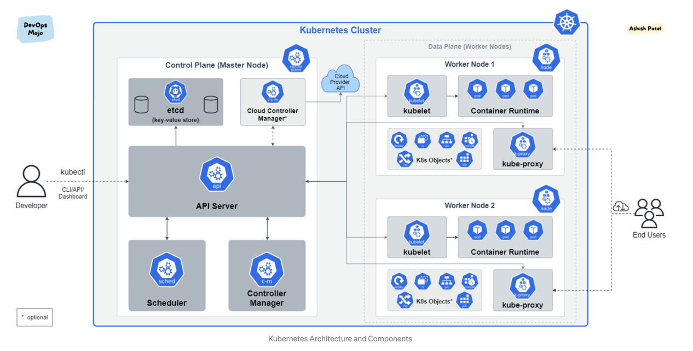

# 쿠버네티스 이해하기

## 쿠버네티스란?
* 쿠버네티스는 컨테이너 오케스트레이션을 위한 솔루션.

## 컨테이너 오케스트레이션이란?
* 다수의 컨테이너를 유기적으로 연결, 실행, 종료할 뿐만 아니라 상태를 추적하고 보전하는 등 컨테이너를 안정적으로 사용할 수 있게 유지시켜 준다.

## 쿠버네티스 구성 요소

[참고 링크](https://medium.com/devops-mojo/kubernetes-architecture-overview-introduction-to-k8s-architecture-and-understanding-k8s-cluster-components-90e11eb34ccd)

## Master Node

### kubectl
* 쿠버네티스 클러스터에 명령을 내리는 역할
* 바로 실행되는 명령 형태인 바이너리로 배포되기 때문에 마스터에 있을 필요는 없음
* 통상적으로 API Server 와 통신을 주로 함.

### API Server
* 쿠버네티스 클러스터의 중심 역할을 하는 통로.
* 모든 클러스터 컴포넌트의 상태를 추적하고, 컴포넌트들 사이의 상호작용을 매니징한다.
* 수평적 확장이 가능하도록 설계되었다.
* 클러스터로부터 요청이 왔을 때, 해다애 요청의 유효성을 검증한다.

### etcd (key-value store)
* 컴포넌트들의 상태 값을 저장하는 key-value 기반의 저장소이다.
* 분산 저장이 가능하여 여러 곳에 저장해 두면 하나의 etcd 에서 장애가 발생하더라도 가용성을 확보할 수 있다.

### Controller Manager
* 오브젝트들에 요구되는 상태들을 감시하고, 현재의 상태가 요구되는 상태로 적절히 유지되도록 관리한다.
* 여러 종류의 컨트롤러가 존재한다.
  * Node Controller
    * 노드들이 다운되었을 때, 이를 알리고 응답하는 책임을 가지고 있다.
  * Job Controller
    * 계속해서 실행되어야 하는 성격이 아니라 실행되고나서 종료되어야 하는 성격의 작업을 실행시킬 때 사용하는 컨트롤러이다.
  * Endpoints Controller

### Scheduler
* 노드의 상태와 자원, 레이블, 요구 조건 등을 고려하여 파드를 어떤 워커 노드에 생성할 것인지를 결정하고 할당한다.

## Worker Node

### kubelet
* 파드의 PodSpec 을 받아서 컨테이너 런타임으로 전달하고, 파드 안의 컨테이너들이 정상적으로 작동하는지 모니터링한다.
* 클러스터의 모든 노드에서 실행된다.
* API Server 와 노드 사이의 수도관 역할을 한다.

### Container Runtime (CRI, Container Runtime Interface)
* 파드를 이루는 컨테이너의 시작, 실행, 중지를 담당한다.
* 파드 안에서 다양한 종류의 컨테이너가 문제 없이 작동하게 만드는 표준 인터페이스이다.

### Pod
* 한 개 이상의 컨테이너로 단일 목적의 일을 하기 위해서 모인 단위.
* 파드는 언제라도 죽을 수 있는 존재.

## 옵셔널한 구성 요소

### Network Plugin
* 쿠버네티스 클러스터 통신을 위해서는 네트워크 플러그인 선택하고 구성해야 한다.
* 일반적으로 CNI(Container Network Interface)로 구성하고, 주로 캘리코(Calico), 플래널(Flannel), 위브넷(WeaveNet) 등을 사용한다.
* CNI 는 구성방식과 지원하는 기능, 성능이 각기 다르므로 사용 목적에 맞게 선택하면 된다.
  * ex) Calico 는 L3로 컨테이너 네트워크를 구성하고, Flannel 은 L2로 컨테이너 네트워크를 구성한다.

### CoreDNS
* 쿠버네티스 클러스터에서 도메인 이름을 이용해 통신하는 데 사용하는 DNS Server 이다.

### kube-proxy
* 쿠버네티스 클러스터는 파드가 위치한 노드에 kube-proxy를 통해 파드가 통신할 수 있는 네트워크를 설정한다.
* 실제 통신은 br_netfilter와 iptables로 관리한다.

---

## Lifecycle of pod
1. kubectl을 통해 API Server에 파드 생성 요청
2. API 서버에 전달된 내용이 있으면 API 서버는 etcd에 전달된 내용을 기록하여 클러스터의 상태 값을 최신 상태로 유지한다.
3. API 서버에 파드 생성이 요청된 것을 컨트롤러 매니저가 인지하면 파드를 생성하고, 이 상태를 API 서버에 전달한다.
4. API 서버에 파드가 생성됐다는 정보를 스케줄러가 인지하면, 시케줄러는 생성된 파드를 어떤 워커 노드에 띄울지 결정하고, 해당 워커 노드에 파드를 띄우도록 요청한다.
5. API 서버에 전달된 정보대로 지정한 워커 노드에 파드가 속해 있는지 스케줄러가 kubelet으로 확인한다.
6. kubelet에서 컨테이너 런타임으로 파드 생성 요청을 한다.
7. 파드가 생성되고, 사용 가능한 상태가 된다.

> 쿠버네티스는 절차적으로 진행하는 구조가 아니라 선언적인 시스템 구조를 가지고 있다.
> 즉, 각 요소가 추구하는 상태를 선언하면 현재 상태와 맞는지 점검하고 그것에 맞추려고 노력하는 구조이다.
> (주기적으로 폴링을 하는건가?)
