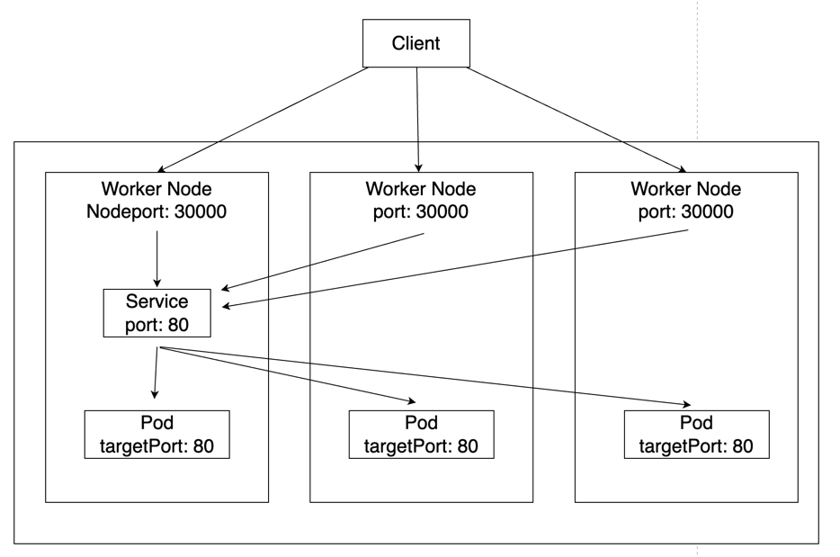

# 쿠버네티스 클러스터와 외부 네트워크

## 서비스
* 외부에서 쿠버네티스 클러스터에서 실행중인 파드에 접근할 수 있도록 네트워크를 노출하는 추상화 방법.
* 서비스 덕분에 서비스 디스커버리 메커니즘을 사용하기 위해 애플리케이션을 수정할 필요가 없다.
  * 쿠버네티스는 파드에게 고유한 IP주소와 파드 집합에 대한 단일 DNS 명을 부여하고, 그것들 간에 로드밸런싱을 수행할 수 있다.

### 노드포트 (NodePort)
* 고정 포트로 각 노드의 IP에 서비스를 노출시키고, 해당 포트로 들어오는 모든 요청을 노드포트 서비스로 라우팅한다.
* 노드포트 서비스가 라우팅되는 ClusterIP 서비스가 자동으로 생성된다.
  * ClusterIP : 서비스를 클러스터 내부 IP에 노출시킨다. 해당 타입은 클러스터 내에서만 서비스에 도달할 수 있다. ServiceTypes의 기본값.
```yaml
# 노드포트 Spec Example
apiVersion: v1
kind: Service
metadata:
  name: np-svc
spec:
  selector:
    app: np-pods
  ports:
    - name: http
      protocol: TCP
      port: 80
      targetPort: 80
      nodePort: 30000
  type: NodePort
```

* nodePort: 워커노드에서 노출되는 포트 (옵셔널한 설정이며, 기본적으로 쿠버네티스 컨트롤 플레인은 30000-32767 범위 내에서 포트를 할당한다.)
* port: 클러스터 내부에서 사용할 서비스 객체의 포트 (편의상 targetPort와 port는 같은 값으로 설정한다.)
* targetPort: 서비스 객체로 전달된 요청을 파드로 전달할 때 사용하는 포트
* 서비스 셀렉터와 일치하는 파드를 지속적으로 검색하고, "np-pods"라는 엔드포인트 오브젝트에 대해 이름이 동일하다면 같은 파드로 간주하여 여러 파드에 부하를 분산시킬 수 있다.

### expose 명령어
* 노드포트 서비스는 오브젝트 스펙 파일이 아닌, expose 명령어로 생성할 수도 있다.
```shell
> kubectl expose deployment np-pods --type=NodePort --name=np-svc-v2 --port=80
```
* 서비스 이름: np-svc-v2
* type: NodePort
* port: 80
* expose를 사용하면 노드포트의 포트 번호를 지정할 수 없다.
  * 포트번호는 30000~32767 에서 임의로 선택된다.

### 인그레스(Ingress), 인그레스 컨트롤러 (Ingress Controller)
* 클러스터 내의 서비스에 대한 외부 접근을 관리하는 API 오브젝트. (일반적으로 HTTP를 관리함)
* 외부의 요청을 처리할 수 있는 NodePort, ExternalIP는 일반적으로 L4에서 처리하며, L7 에서의 요청을 처리할 수 없다.
* 인그레스는 고유한 주소를 제공해 사용 목적에 따라 다른 응답을 제공할 수 있고, 트래픽에 대한 L4/L7 로드밸런서와 SSL을 처리하는 기능을 제공한다.
* 인그레스는 규칙을 정의하는 선언적인 오브젝트일 뿐, 외부의 요청을 받아들이는 실제 서버가 아니다.
* 인그레스 컨트롤러라고 하는 특수한 서버 컨테이너에 적용되어야 인그레스에 적용된 규칙이 활성화 된다.
* 사용하는 환경에 따라 Nginx 기반의 ingress-nginx를 사용하거나 클라우드 플랫폼에서 제공하는 인그레스 컨트롤러를 이용할 수 있다.

```yaml
# Ingress Spec Example
apiVersion: networking.k8s.io/v1
kind: Ingress
metadata:
  name: minimal-ingress
  annotations:
    nginx.ingress.kubernetes.io/rewrite-target: /
spec:
  rules:
    - http:
        paths:
          - path: /
            pathType: Prefix
            backend:
              service:
                name: rootSvc
                port:
                  number: 80
          - path: /testpath
            pathType: Prefix
            backend:
              service:
                name: test
                port:
                  number: 80
```

## 데몬셋 (DaemonSet)
* 디플로이먼트의 replicas가 노드 수만큼 정해져 있으며, 노드 한 대당 파드 한 개만을 생성한다.
* 데몬셋의 일부 대표적인 용도
  * 모든 노드에서 클러스터 스토리지 데몬 실행
  * 모든 노드에서 로그 수집 데몬 실행
  * 모든 노드에서 노드 모니터링 데몬 실행
```yaml
# DaemonSet Spec Example
apiVersion: apps/v1
kind: DaemonSet
metadata:
  name: fluentd-elasticsearch
  namespace: kube-system
  labels:
    k8s-app: fluentd-logging
spec:
  selector:
    matchLabels:
      name: fluentd-elasticsearch
  template:
    metadata:
      labels:
        name: fluentd-elasticsearch
    spec:
      tolerations:
      # this toleration is to have the daemonset runnable on master nodes
      # remove it if your masters can't run pods
      - key: node-role.kubernetes.io/master
        operator: Exists
        effect: NoSchedule
      containers:
      - name: fluentd-elasticsearch
        image: quay.io/fluentd_elasticsearch/fluentd:v2.5.2
        resources:
          limits:
            memory: 200Mi
          requests:
            cpu: 100m
            memory: 200Mi
        volumeMounts:
        - name: varlog
          mountPath: /var/log
        - name: varlibdockercontainers
          mountPath: /var/lib/docker/containers
          readOnly: true
      terminationGracePeriodSeconds: 30
      volumes:
      - name: varlog
        hostPath:
          path: /var/log
      - name: varlibdockercontainers
        hostPath:
          path: /var/lib/docker/containers
```

## 컨피그맵(ConfigMap)
* 키-값 쌍으로 기밀이 아닌 데이터를 저장하는 데 사용하는 API 오브젝트이다.

## PV(PersistentVolumn)와 PVC(PersistentVolumeClaim)
* PV는 관리자가 프로비저닝하거나 스토리지 클래스를 사용하여 동적으로 프로비저닝한 클러스터의 스토리지이다.
* PV는 키-벨류 기반의 저장소이다.
* PVC는 사용자의 스토리지에 대한 요청이다.
* PVC는 PV 리소스를 사용한다.

## 스테이트풀셋(StatefulSet)
* 스테이트풀셋은 데이터 스토어처럼 데이터를 계속 유지하는, 상태가 있는 애플리케이션을 관리하는 데 적합한 리소스이다.
* 디플로이먼트와 유사하게, 스테이트풀셋은 동일한 컨테이너 스펙을 기반으로 둔 파드들을 관리한다.
* 디플로이먼트와 다르게, 지속적으로 유지되는 식별자를 붙여 파드를 생성한다.

---
## 쿠버네티스가 컨테이너를 다루는 과정
1. 사용자가 kube-apiserver의 URL로 요청을 전달하거나 kubectl을 통해 명령어를 입력해 kube-apiserver에 파드를 생성하는 명령을 내린다.
2. 파드 생성 명령은 네트워크를 통해 kubelet으로 전달된다.
3. kubelet 으로 생성 요청이 전달되면 kubelet은 요청이 적절한 사용자로부터 전달된 것인지 검증한다.
4. kubelet에서 요청을 검증하고 나면 containerd에 컨테이너를 생성하는 명령을 내린다. 이때 명령의 형식은 CRI 규약을 따른다.
   1. CRI는 컨테이너와 관련된 명령을 내리는 런타임 서비스(Runtime Service)와 이미지와 관련된 명령을 내리는 이미지(Image Service)로 이루어져있다.
   2. 런타임 서비스는 파드의 생성, 삭제, 정지, 목록 조회와 컨테이너 생성, 시작, 정지, 삭제, 목록조회, 상태 조회 등의 다양한 명령을 내린다.
   3. kubelet이 내린 명령은 containerd에 통합된 CRI 플러그인이라는 구성 요소에 전달되어, containerd가 컨테이너를 생성하는 명령을 직접 호출한다.
5. containerd는 containerd-shim이라는 자식 프로세스를 생성하여 컨테이너를 관리한다.
   1. containerd와 container-shim은 부모와 자식 관계이다.
6. containerd가 생성한 containerd-shim 프로세스는 컨테이너를 조작한다.
