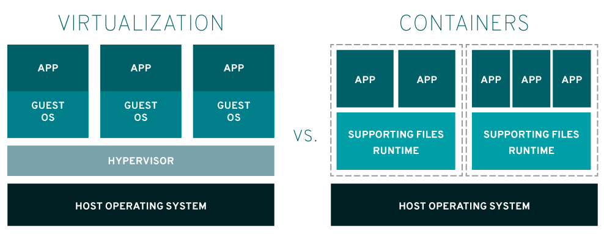
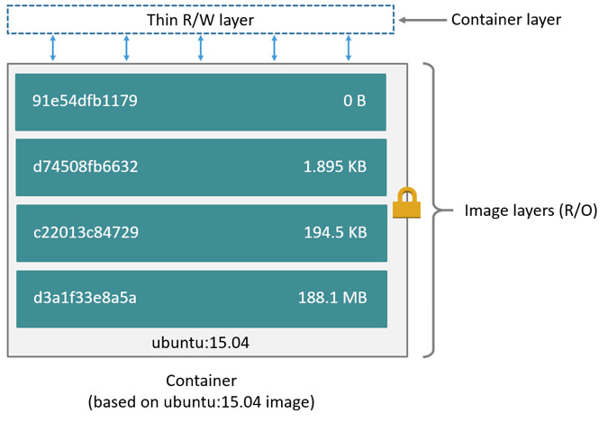

# 도커와 컨테이너
## 파드, 컨테이너, 쿠버네티스
* 파드는 워커 노드라는 노드 단위로 관리된다.
* 워커 노드와 마스터 노드가 모여서 쿠버네티스 클러스터가 된다.
* 파드는 1개 이상의 컨테이너로 구성되어 있다.

### 컨테이너

* 컨테이너는 하나의 운영 체제 안에서 커널을 공유하며 개별적인 실행 환경을 제공하는 격리된 공간이다.
* 컨테이너 기술의 핵심은 다음 세 가지다.
  * 컨트롤 그룹 (cgroup)
  * 네임스페이스
  * 통합 파일 시스템 (Union filesystem)

### 컨트롤 그룹
* 프로세스들의 리소스 사용(CPU, 메모리, 디스크 입출력, 네트워크 등)을 제한하고 격리시키는 리눅스 커널 기능이다.
* 컨테이너는 미리 정의된 제약 조건 하에 CPU와 메모리를 공유할 수 있다.
* 컨트롤 그룹을 사용하여 컨테이너가 메모리, 디스크 I/O, 네트워크, CPU에 대한 접근을 프로비저닝하고 디바이스에 접근한다.

#### 주요 7가지 컨트롤 그룹
  * memory cgroup
    * 페이지 접근을 그룹별로 추적하며 물리 메모리, 커널 메모리, 전체 메모리에 대한 제한을 정의할 수 있다.
  * Blkio cgroup
    * 물리 드라이브(ex: 디스크, 솔리드 스테이트, USB 등)와 간ㅌ은 블록 장치에 대한 I/O 액세스에 제한을 설정한다.
  * CPU cgroup
    * CPU당 사용자 및 시스템의 CPU 시간 및 사용량을 추적한다.
  * Freezer cgroup
    * cgroup의 작업을 일시 중지하거나 다시 시작한다.
  * CPUset cgroup
    * 개별 CPU(멀티코어 시스템에서) 및 메모리 노드를 croup의 작업에 할당한다.
    * 멀티 코어 CPU 아키텍처 내의 특정 CPU에 그룹을 고정할 수 있다.
    * 애플리케이션별로 CPU를 고정하면 CPU 사이에서 이동하지 않게 해 로컬 메모리 접근량을 늘리거나 스레드 전환을 최소화해 코드의 성능을 향상시킬 수 있다.
  * Net_cls/net_prio cgroup
    * Linux 트래픽 컨트롤러(tc)가 특정 cgroup 작업에서 발생하는 패킷을 식별하게 하는 클래식 식별자(classid)를 사용하여 네크워크 패킷에 태그를 지정한다.
    * cgroup 내의 프로세스에서 생성되는 송신 트래픽 클래스(cls)나 우선순위(net_prio)를 감시한다. 
  * devices cgroup
    * cgroup의 작업 단위로 장치에 대한 액세스 권한을 제어한다.

#### 네임스페이스
* VM에서는 각 게스트 머신별로 독립적인 공간을 제공하고 서로가 충돌하지 않도록 하는 기능이 있는데, 리눅스에서는 동일한 역할을 하는 namespace 기능을 커널에 내장하고 있다.
* 리눅스 네임스페이스는 unshare라는 시스템 호출(syscall)로 생성하며, clone과 setns를 사용하면 unshare 과는 다른 방식으로 네임스페이스를 조작할 수 있다.
  * unshare() - 현재 프로세스를 새로 지정된 네임스페이스에 연결
  * clone() - 새로운 프로세스를 만들고 이를 새로 지정된 네임스페이스에 연결
  * setns() - 이미 존재하는 네임스페이스에 프로세스를 연결
* 리눅스 커널에서 지원하는 namespace
  * mnt namespace (마운트 네임스페이스)
    * 파일 시스템 마운트 포인트를 격리한다.
    * 호스트 파일 시스템에 영향을 주지 않고, 독립적으로 파일 시스템을 마운트하거나 언마운트 할 수 있다.
  * pid namespace (프로세스)
    * pid namespace 는 PID 집합을 다른 네임스페이스의 PID 집합과 독립적인 프로세스에 할당한다.
    * PID 1인 새로운 네임스페이스인 첫 번째 프로세스가 생성되고, 자식 프로세스는 그 다음 PID를 갖는다.
    * 자식 프로세스가 자신의 PID 네임스페이스를 사용하여 생성된 경우, PID 1을 가지고 있고, 부모 프로세스의 네임스페이스에도 PID가 있다. 

  * net namespace (네트워크 네임스페이스)
    * 독립적인 네트워크 스택을 가지며, namespace 간에 network 충돌을 방지한다.
  * ipc namespace (interprocess communication namesapce)
    * 프로세스간의 독립적인 통신통로를 할당한다.
  * uts namespace (UNIX Time-sharing)
    * 단일 시스템이 다른 호스트와 도메인 이름 스키마를 다른 프로세스에 제공할 수 있게 한다.
  * user namespace (UID)
    * user namespace 는 프로세스가 외부에서 허용되는 것과 다른 사용자 식별자 및 권한으로 해당 namespace 내부에서 실행될 수 있도록 격리한다.
    * 프로세스는 네임스페이스 외부에서 0이 아닌 UID를 가질 수 있는 동시에 네임스페이스 내부에 0인 UID를 가질 수 있다. 즉, 프로세스는 user namespace 외부의 작업에 대해 권한이 없지만 namespace 내부에서는 루트권한이 있다.

### 통합 파일시스템 (UFS: Union Filesystem)
* 도커 컨테이너는 UFS 기반으로 동작한다. 
* 복수의 파일시스템을 하나의 파일시스템으로 마운트한다.
* 두 파일 시스템에서 동일한 파일이 있다면 나중에 마운트된 파일 시스템의 파일을 오버레이한다.
* UFS 에서는 기존 레이어(하위 레이어) 위에 새로운 레이어(상위 레이어)가 쌓일 경우, 하위 레이어는 읽기 전용 상태가 된다.
* 하위 파일 시스템에 대한 쓰기 작업은 Cow(Copy On Write) 전략에 따라 복사본을 생성하여 수행하므로 원본 파일 시스템은 변하지 않는다.
* 레이어화된 파일시스템이 효율적인 이유는 처음 빌드할 때 레이어를 도커가 캐싱하기 때문이다.
  * 예를 들어 우분투 이미지에 아파치 이미지를 추가하여 이미지를 빌드한 후에 다시 우분투 이미지를 기반으로 다시 MySQL 이미지를 빌드한다고 가정할 때, 우분투 레이어가 미리 캐싱되어 있으므로 두 번째 빌드는 훨씬 빠르다.


---
## 이미지 검색 및 내려받기
* 이미지는 레지스트리(registry)라고 하는 저장소에 저장되어 있다.
* 레지스트리는 도커 허브처럼 공개된 레지스트리일 수도 있고, 내부에서 직접 구축한 레지스트리일 수도 있다.

#### 이미지 검색하기
```shell
> docker search <검색어>
```
* 검색어를 포함하는 이미지를 찾는다.
* 이미지는 애플리케이션, 미들웨어 등 고유한 목적에 맞게 패키지되어 있다.
* docker search 로 찾은 이미지는 docker pull 로 내려받을 수 있다.

```shell
> docker pull <이미지>
```
* 이미지를 내려받을 때 사용하는 태그, 레이어, 이미지의 고유 식별 값 등을 볼 수 있다.
* 태그(tag)
  * Using default tag와 함께 뒤에 따라오는 태그 이름을 통해 이미지를 내려받을 때 사용한 이미지를 알 수 있다.
  * 아무런 값을 주지 않고, 이미지 이름만으로 pull 하면 latest 태그가 적용된다. latest 태그는 가장 최신 이미지를 의미한다.
* 레이어(layer)
  * 하나의 이미지는 여러 레이어로 이루어져 있어서 레이어마다 Pull complete 메시지가 발생한다.
* 다이제스트(digest)
  * 이미지의 고유 식별자로, 이미지에 포함된 내용과 이미지의 생성 환경을 식별할 수 있다.
  * 식별자는 해시 함수로 생성되며, 이미지가 동일한지 검증하는 데 사용한다.
* 상태(status)
  * 이미지를 내려받은 레지스트리, 이미지, 태그 등의 상태 정보를 확인할 수 있다.
  * 형식은 '레지스트리 이름/이미지 이름 이름:태그' 이다.

---
## 참고자료
[컨트롤 그룹](https://access.redhat.com/documentation/ko-kr/red_hat_enterprise_linux/6/html/resource_management_guide/ch01) </br>
[네임스페이스와 cgroup](https://www.nginx.com/blog/what-are-namespaces-cgroups-how-do-they-work/#pid-namespaces) </br>
[Docker volumnes](https://docs.docker.com/storage/storagedriver/)