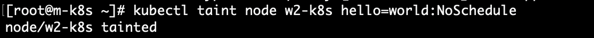
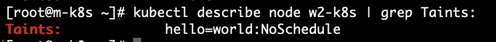
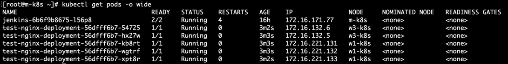
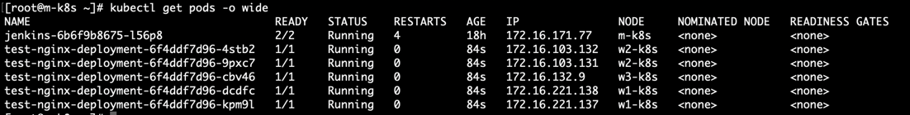

# 컨테이너 인프라 환경의 CI/CD

### CI (Continuous Integration)
* 코드를 커밋하고 빌드했을 때 정상적으로 작동하는지 반복적으로 검증하여 애플리케이션의 신뢰성을 높이는 작업이다.
* 개발자가 코드를 커밋하고 푸시하면 CI 단계로 진입하며, 자동으로 빌드하고 테스트를 거쳐 배포할 수 있는 신뢰성 있는 애플리케이션인지 검증한다.
* CI 단계를 통해 검증이 끝났으면 CD 로 넘어간다.

### CD (Continuous Deployment)
* 애플리케이션을 컨테이너 이미지로 만들어서 파드, 디플로이먼트 등 다양한 오브젝트 조건에 맞추어 미리 설정한 파일을 통해 배포한다.

## 배포 간편화 도구들

### kubectl
* 쿠버네티스에 기본으로 포함된 커맨드라인 도구이며, 추가 설치 없이 바로 사용할 수 있다.
* 오브젝트 생성과 쿠버네티스 클러스터에 존재하는 오브젝트, 이벤트 등의 정보를 확인할 수 있어서 사용하는 활용도가 높다.
* 정의된 Manifest 파일을 그대로 배포하기 때문에 개별적인 오브젝트를 관리하거나 배포할 때 사용하는 것이 좋다.

### kustomize
* kustomization 파일을 통해 쿠버네티스 오브젝트를 사용자의 필요에 따라 변경하는 도구이다.
* 별도의 kustomize 실행 파일을 활용하여 kustomize 명세를 따르는 yaml 파일을 생성할 수 있다.
* kubectl 로도 yaml 파일을 통해 배포할 수 있는 옵션인 (-k)를 제공한다.
* 명령어로 배포 대상 오브젝트 이미지 태그와 레이블 같은 명세를 변경하거나 일반 파일을 이용해 Config Map과 Secret을 생성하는 기능을 지원한다.
* 운영중인 환경에서 배포 시 가변적인 요소를 적용하는데 적합하다.

### Helm
* Kubernetes 패키지 관리툴이다.
* 오브젝트 배포에 필요한 사양이 이미 정의된 차트(Chart)라는 패키지를 활용한다.
* 헬름 차트는 자체적인 템플릿 문법으로 사용하므로 가변적인 인자를 배포할 때 적용해 다양한 배포 환경에 맞추거나 원하는 조건을 적용할 수 있다.

## Kustomize 실습해 보기
* 쿠버네티스에서 오브젝트에 대한 수정 사항을 반영하려면 사용자가 직접 yaml 파일을 수정해야 한다.
* 커스터마이즈는 yaml 파일에 정의된 값을 사용자가 원하는 값으로 변경할 수 있다.
* kustomize 명령과 create 옵션으로 kustomizaion.yaml 이라는 기본 manifest 파일을 민들고, 이 파일에 변경해야 하는 값을 적용할 수 있다.

```shell
# kustomize create 명령을 통해 kustomization.yaml 파일을 생성할 수 있다.
> kustomize create --namespace=metallb-system --resources namespace.yaml,metallb.yaml,metallb-l2config.yaml
```
* --namespace는 작업의 네임스페이스를 설정한다.
* --resources는 kustomize 명령을 이용해서 kustomization.yaml 을 만들기 위한 소스 파일을 정의한다.
```yaml
# 아래는 위 명령을 통해 생성된 kustomization.yaml 내용이다.
apiVersion: kustomize.config.k8s.io/v1beta1
kind: Kustomization
resources:
  - namespace.yaml
  - metallb.yaml
  - metallb-l2config.yaml
namespace: metallb-system
````


* kustomize edit set image 옵션을 통해 태그를 지정할 수 있다.
```shell
> kustomize edit set image metallb/controller:v0.8.2
> kustomize edit set image metallb/speaker:v0.8.2
```
```yaml
# 아래는 위 명령어를 통해 수정된 kustomization.yaml
apiVersion: kustomize.config.k8s.io/v1beta1
kind: Kustomization
resources:
- namespace.yaml
- metallb.yaml
- metallb-l2config.yaml
namespace: metallb-system
images:
- name: metallb/controller
  newTag: v0.8.2
- name: metallb/speaker
  newTag: v0.8.2
```

* kustomize build 명령으로 MetalLB 설치를 위한 Manifest 를 생성할 수 있다.
* kubectl apply -f 를 통해 빌드된 Manifest 를 적용할 수 있다.
* 아래의 명령에서는 생성된 Manifest 의 결과가 kubectl apply 인자로 전달되도록 배포하는 방법이다.
```shell
> kustomize build | kubectl apply -f -
```

## Helm 실습해 보기
* 헬름은 쿠버네티스에 패키지를 손쉽게 배포할 수 있도록 도와주는 패키지 매니저이다.
* 다양한 요구 조건을 처리할 수 있도록 리소스를 편집하거나 변수를 넘겨서 패키지를 만들 수 있는데, 이를 차트라고 한다.
* 헬름의 기본 저장소는 artifacthub.io 이다.

```shell
# 아래 명령을 통해 헬름 차트 저장소를 추가한다.
> helm repo add <name> <repo uri>

# 아래의 명령을 통해 헬름 차트 저장소 목록을 확인할 수 있다.
> helm repo list

# 아래의 명령을 통해 저장소가 추가된 이후에 변경된 차트가 있다면 변경된 정보를 캐시에 업데이트하여 최신 차트 정보를 동기화한다.
> helm repo update
```
* helm 차트를 설치할 때는 helm install 을 이용하면 된다.
```shell
# helm install <release name> [-f <config path>] [--namespace=<namespace name>] [--set <key>=<value>,...]
helm install metallb edu/metallb \
> --namespace=metallb-system \
> --create=namespace \
> --set controller.tag=v0.8.3 \
> --set speaker.tag=v0.8.3 \
> --set configmap.ipRange=192.168.56.11-192.168.56.29
```
* --namespace: 헬름 차트를 통해서 생성되는 애플리케이션이 위치할 네임스페이스를 지정한다.
* --create-namespace: 네임스페이스 옵션으로 지정된 네임스페이스가 존재하지 않는 경우 네임스페이스를 생성한다.
* --set: 헬름에서 사용할 변수를 명령 인자로 전달한다. key1=value1, key2=value2 와 같이 ,(쉼표)를 사용하여 한 줄에서 여러 인자를 넘겨줄 수도 있다.

```shell
# 헬름에 필요한 변수를 확인하는 명령어
> helm show values <차트>
# or
> helm inspect values <차트>
```
```shell
# 차트 설치 후, 설정 내용을 수정하여 다시 배포한다.
# helm upgrade <release name> [-f config path] <chart>
> helm upgrade metallb edu/metallb \
> --namespace=metallb-system \
> --set configmap.ipRange=192.168.56.11-192.168.56.29
```
```shell
# 설치된 차트 목록을 검색한다.
> helm ls

# 모든 네임스페이스의 차트 목록을 검색한다.
> helm ls --all-namespace
# or
> helm ls -A
```
```shell
# 설치된 차트를 제거한다.
# helm uninstall <release name>
> helm uninstall metallb
```

### Taints 와 Tolerations

#### taints
* 테인트는 노드마다 설정이 가능하며, 설정한 노드에는 파드가 스케줄되지 않는다.
* key, value, effect 정의를 통해 테인트를 설정한다.
* 일반적으로 마스터 노드에는 클러스터 관련 파드를 제외하고, 다른 파드 들은 스케줄링 되지 않는데 이는 테인트 설정이 되어있기 때문이다.
```shell
# node1 노드에 테인트를 배치한다. 테인트에는 키 key1, 값 value1 및 테인트 이펙트(effect) NoSchedule이 있다.
# 이는 일치하는 톨러레이션이 없으면 파드를 node1 에 스케줄 할 수 없음을 의미한다.
> kubectl taint nodes node1 key1=value1:NoSchedule
```
```shell
# 실제로 현재 실습중인 마스터 노드에 describe 명령을 살펴보면 톨러레이션 없이는 파드가 스케줄되지 않도록 설정이 되어 있는 것을 확인할 수 있다.
> kubectl describe node m-k8s | grep Taints:
> Taints:             node-role.kubernetes.io/master:NoSchedule
```
```shell
# 테인트 삭제는 아래와 같이 명령어를 사용하면 된다.
> kubectl taint nodes node1 key1=value1:NoSchedule-
```

#### taints effect
* NoSchedule
  * 노드에 파드가 배치되는 것을 거부한다.
  * 테인트가 설정될 때, 해당 노드에 이미 파드가 존재하면 유지한다.
* PreferNoSchedule
  * 다른 노드에 파드 배치가 불가능할 때는 노드에 파드가 배치된다.
  * 테인트가 설정될 때, 해당 노드에 이미 파드가 존재하면 유지한다.
* NoExecute
  * 노드에 파드 배치를 거부한다.
  * 테인트가 설정될 때, 해당 노드에 이미 파드가 존재한다면 노드에서 파드를 제거한다.

#### tolerations
* 톨러레이션은 테인트가 설정된 노드로 들어가기 위한 열쇠와 같은 역할을 한다. (toleration은 사전적으로 용인, 관용이라는 뜻으로, 테인트의 설정을 허용한다는 뜻으로 해석하면 된다.)
* key, value, effect, operator 정의를 통해 톨러레이션을 설정한다.
* operator에는 Equal, Exists 연산자가 존재한다. (기본값은 Equal)
  * Equal은 톨러레이션의 key, value, effect 조건에 일치하는지 확인한다.
  * Exists는 사용했을 때, value는 반드시 생략해야하며, key와 effect가 일치하는지 확인한다.
    * key와 effect를 모두 생략한 상태에서 Exists 연산자만 사용하면 테인트의 key와 effect는 모든 key와 effect를 의미하므로, 모든 것이 톨러레이션된다.

#### taints, toleration 사용해보기
* 현재 클러스터 구성은 마스터 노드 1, 워커 노드 3으로 구성되어 있고, 이중에 워커 노드2 에 테인트를 설정하였다.


* 아래와 같이 deployment 를 정의하여 nginx 파드를 5대를 생성시켜 보았다.
```yaml
apiVersion: apps/v1
kind: Deployment
metadata:
  name: test-nginx-deployment
  labels:
    app: test-nginx-deployment
spec:
  replicas: 5
  selector:
    matchLabels:
      app: test-nginx-pod
  template:
    metadata:
      labels:
        app: test-nginx-pod
    spec:
      containers:
        - name: test-nginx
          image: nginx:latest
          ports:
            - containerPort: 80
```
* 생성된 deployment의 파드들이 위치한 노드를 kubectl get pods -o wide 명령을 통해 확인한다.

* w2-k8s를 제외한 w1-k8s, w3-k8s 노드에만 nginx 파드들이 배치된 것을 확인할 수 있다.


* 이제 톨러레이션을 정의해보자
```yaml
apiVersion: apps/v1
kind: Deployment
metadata:
  name: test-nginx-deployment
  labels:
    app: test-nginx-deployment
spec:
  replicas: 5
  selector:
    matchLabels:
      app: test-nginx-pod
  template:
    metadata:
      labels:
        app: test-nginx-pod
    spec:
      containers:
        - name: test-nginx
          image: nginx:latest
          ports:
            - containerPort: 80
      tolerations:
        - key: "hello"
          value: "world"
          operator: "Equal"
          effect: "NoSchedule"
```

* 위 결과를 확인해 보면 톨러레이션을 통해 w2-k8s 노드에 nginx 파드가 스케줄링된 것을 확인할 수 있다.

### RBAC (Role-Based Access Control)
* 역할을 기반으로 쿠버네티스 시스템의 권한을 관리한다.
* Role: 특정 api나 리소스에 대한 권한들을 명시해둔 정책이다.
  * Role은 apiGroups, resources, verbs 속성을 가진다.
* Binding: 일반 사용자 및 그룹, 서비스 계정을 롤에 연결한다.

#### Role, ClusterRole
* RBAC의 Role에는 Role과 ClusterRole로 구분된다. 
* Role
  * 해당 롤을 가진 주체가 특정 namespace에서 접근할 수 있는 권한을 정의한다.
* ClusterRole
  * 해당 롤을 가진 주체가 Cluster에서 접근할 수 있는 권한을 정의한다.

#### RoleBinding, ClusterRoleBinding
* RoleBinding
  * 일반 사용자 및 그룹/서비스 계정과 롤을 연결한다.
* ClusterRoleBinding
  * 일반 사용자 및 그룹/서비스 계정과 클러스터 롤을 연결한다.
* subjects 속성을 통해 권한을 사용할 주체와 해당 권한을 연결한다.
* subject는 RBAC에서 특정 행위를 수행하는 주체이다.

[RBAC 참고 자료](https://kubernetes.io/docs/reference/access-authn-authz/rbac/) 에서 예제를 살펴볼 수 있다.

---
#### 참고자료
[컨테이너 인프라 환경 구축을 위한 쿠버네티스/도커](http://www.kyobobook.co.kr/product/detailViewKor.laf?ejkGb=KOR&mallGb=KOR&barcode=9791165215743&orderClick=LEa&Kc=)